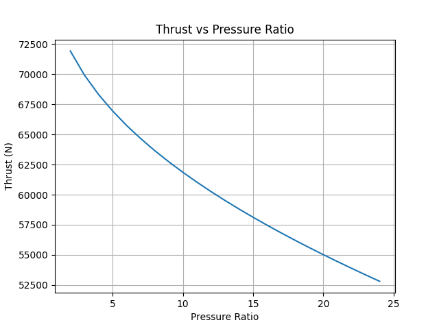
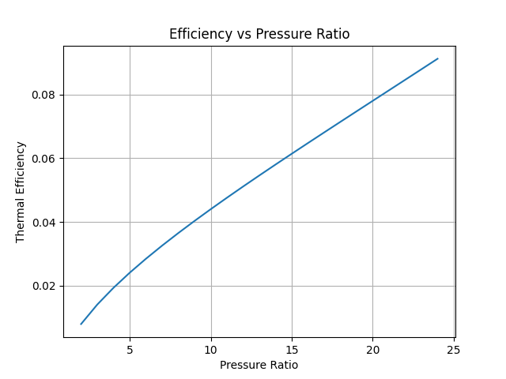

# Gas Turbine Performance Simulator 🚀

A Python-based simulation of a jet engine (Brayton cycle) with parametric analysis.
## 🚀 Project Overview

This project is a Python-based gas turbine (Brayton cycle) simulator developed to analyze how pressure ratio affects thrust and thermal efficiency.

The model was built with AI assistance and used to study real aerospace trade-offs between high-thrust and fuel-efficient engines.
---

## Components

* Compressor
* Combustor
* Turbine
* Nozzle

---

##  Features

* Calculates thrust and thermal efficiency
* Performs parametric analysis
* Generates performance graphs

---

## Results

### Thrust vs Pressure Ratio



### Efficiency vs Pressure Ratio



---

## Insights

* Efficiency increases with pressure ratio
* Thrust decreases due to higher compressor work in simplified model

---

## Tech Stack

* Python
* Matplotlib

---

## ▶️ Run

```bash
pip install -r requirements.txt
python main.py

---

## Author

Pranav Mohan


---


```md
## 📌 Engineering Note
This model uses a simplified Brayton cycle and assumes constant specific heats and no pressure losses. Results capture trends but are not representative of a real engine.
